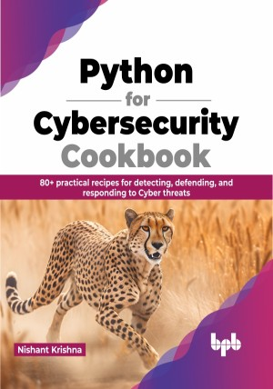

# Python for Cybersecurity Cookbook

Learn how to use Python for vulnerability scanning, malware analysis, reverse engineering, penetration testing, and more.

This is the repository for [Python for Cybersecurity Cookbook
](https://bpbonline.com/products/python-for-cybersecurity-cookbook?variant=42871439524040),published by BPB Publications.

## About the Book
Python is a powerful and versatile programming language that can be used for a wide variety of tasks, including general-purpose applications and specific use cases in cybersecurity.

This book is a comprehensive guide to solving simple to moderate complexity problems in cybersecurity using Python. It starts with fundamental issues in reconnaissance and then moves on to the depths of the topics such as forensic analysis, malware and phishing analysis, and working with wireless devices. Furthermore, it also covers defensive and offensive security topics, such as system hardening, discovery and implementation, defensive security techniques, offensive security techniques, and penetration testing.

By the end of this book, you will have a strong understanding of how to use Python for cybersecurity and be able to solve problems and create solutions independently. 

## What You Will Learn
•  Learn how to use Python for cyber forensic analysis.

•  Explore ways to analyze malware and phishing-based compromises.

•  Use network utilities to gather information, monitor network activity, and troubleshoot issues.

•  Learn how to extract and analyze hidden information in digital files.

•  Examine source code for vulnerabilities and reverse engineering to understand software behavior.
